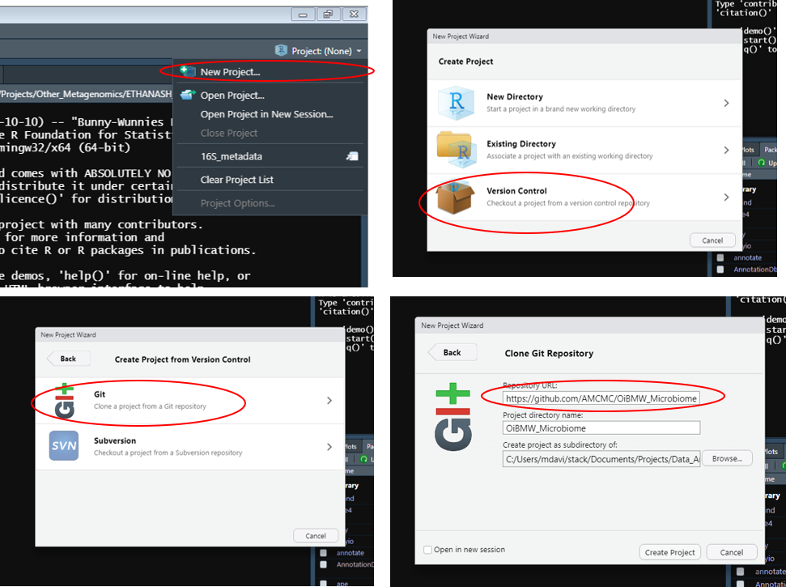
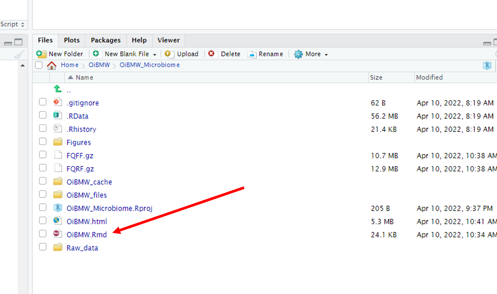
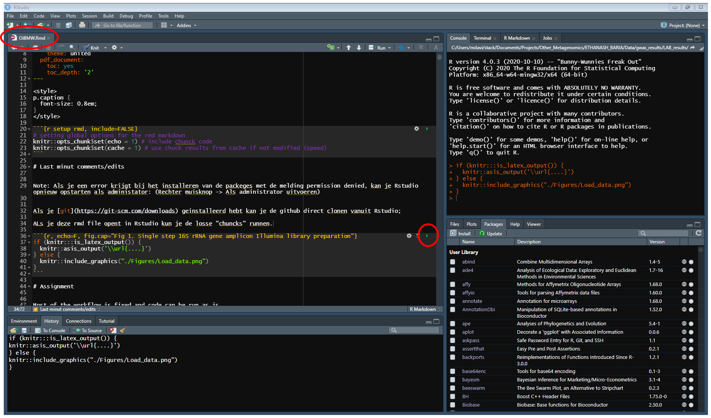
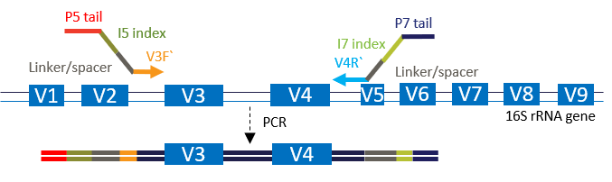
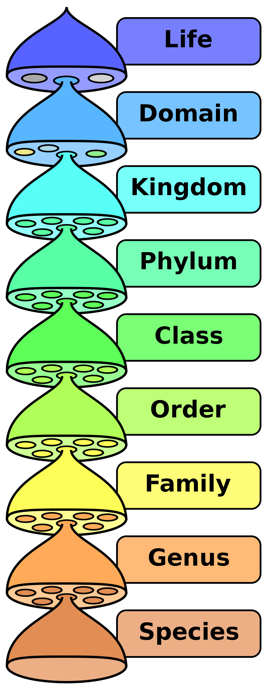

<style>
p.caption {
  font-size: 0.8em;
}
</style>

```{r setup rmd, include=FALSE}
# setting global options for the rmd markdown
knitr::opts_chunk$set(echo = T) # include chunck code
knitr::opts_chunk$set(cache = F) # use chuck results from cache if not modified (speed)
```

# Workshop introduction

In this learning module, we will be working with a 16S rRNA dataset to explore microbial diversity within a sample. To accomplish this, we’ll use RStudio in combination with several specialized packages tailored for microbiome data analysis. Our primary objectives are to identify the bacterial species present in the sample and to quantify the abundance of each species. Each sequence read in the dataset represents an observation, which we will process and analyze to gain insights into the microbial community structure.

Analyzing 16S rRNA data involves several critical steps to ensure the results are accurate and meaningful. One of the most important steps is to differentiate biologically relevant sequences—those that correspond to actual bacterial species—from technical noise, such as sequencing errors. Sequencing technologies can introduce small errors or artefacts, which, if not addressed, can lead to incorrect interpretations of microbial diversity and abundance. Thus, careful data processing, including quality filtering and error correction, is essential to minimize noise and enhance data reliability.

Once we’ve filtered out noise, we’ll proceed with taxonomic assignment, where we match sequence data to known bacterial species or taxa. This step often involves using reference databases and classification algorithms that can accurately categorize bacterial sequences. The final step will be to quantify the presence of each bacterial species, providing a snapshot of the microbial community composition in the sample.

Throughout this module, we’ll discuss and apply each of these analytical steps in detail, helping to build a solid foundation in microbiome data analysis and the principles of bioinformatics.

# R working environment

This workshop can be perfomed on any machine running Rstudio. However might require custom adaptations and will cost a lot of time. Therefore we have setup a dedicated server which runs Rstudio with all requirements preinstalled. 

You can gain acces to the server trough your browser:

http://18.197.136.58/
name: email credentials (no dots)
pass: SHIBIS

You will need to download the associated files and rmarkdown file which was used to generate this tutorial by cloning the associated github repository. You can easily do this from within the Rstudio interface. 

Projects => Version control => Git => https://github.com/AMCMC/SH_IBIS_Day1

```{r, echo=F, fig.cap=""}
if (knitr:::is_latex_output()) {
  knitr::asis_output('\\url{....}')
} else {
  
}
```

Open the rmd file and sequentially run the individual code chuncks.

```{r, echo=F, fig.cap=""}
if (knitr:::is_latex_output()) {
  knitr::asis_output('\\url{....}')
} else {
  
}

if (knitr:::is_latex_output()) {
  knitr::asis_output('\\url{....}')
} else {
  
}
```

# Introduction 16S rRNA amplicon dataset

Amplicon sequencing is the most commonly used approach to determine the microbiome composition of a particular environment. Specific primers targeting universal genes are used to amplify phylogenetic divergent marker sequences. The obtained amplified sequences (amplicons) can than be sequenced using various platforms. The main task when analyzing these datasets is to determine which are true biological sequences and which are technical noise.

```{r, echo=F, fig.cap="Fig 1. Single step 16S rRNA gene amplicon Illumina library preparation"}
if (!"knitr" %in% installed.packages()){install.packages("knitr")}
if (knitr:::is_latex_output()) {
  knitr::asis_output('\\url{....}')
} else {
  
}
```

In this practical session, we will analyze 16S rRNA amplicon sequences obtained from a mock microbial community. These amplicons were generated using universal primers that target the V3V4 regions of the 16S rRNA gene and were sequenced on an Illumina MiSeq platform (2x251) using V3 chemistry. The mock sample was artificially constructed from DNA of 55 unique bacterial strains ([Table 1 - MC3](https://f1000research.com/articles/5-1791/v1)). Because we know the true composition of this sample, it serves as a benchmark for evaluating the accuracy of our wet-lab protocols and bioinformatics pipelines.

During this workshop, we will apply the [DADA2](https://www.nature.com/articles/nmeth.3869) software package to infer the taxonomic composition of the data and compare it to the known composition. DADA2 is specifically designed to identify the true amplicon sequence variants (ASVs) present in a sample, providing high-resolution insights into microbial diversity. Part of this workshop is based on the tutorial available on the [DADA2 website](https://benjjneb.github.io/dada2/tutorial.html).

Other packages we will use include:

* [ggplot2](https://ggplot2.tidyverse.org/) for visualizing data
* [phyloseq](https://joey711.github.io/phyloseq/) for merging and organizing microbiome datasets
* [DECIPHER](http://www2.decipher.codes/) for generating a multiple sequence alignment
* [phangorn](https://github.com/KlausVigo/phangorn)  for constructing a phylogenetic tree

# Configure R environment and get data

All dependancies are preinstalled in the server, however if you wish to run it on your own machine, the following code will install everything required locally. 

```{r load libraries}
.cran_packages <- c("ggplot2", "reshape2", "stringr","phangorn","DT","ape","ggrepel","knitr","Hmisc")
.bioc_packages <- c("dada2", "phyloseq","ShortRead","DECIPHER","ggtree")
```

```{r, eval=F, message=FALSE, include=F}
.inst <- .cran_packages %in% installed.packages()
if(any(!.inst)) {
   install.packages(.cran_packages[!.inst])
}

# R version check!
.inst.bc <- .bioc_packages %in% installed.packages()
if(any(!.inst)) {
   source("http://bioconductor.org/biocLite.R")
   biocLite(.bioc_packages[!.inst], ask = F)
}

.inst.bc <- .bioc_packages %in% installed.packages()
if (!requireNamespace("BiocManager", quietly = TRUE))
    install.packages("BiocManager")
BiocManager::install(.bioc_packages[!.inst.bc])
```

```{r, warning=F}
sapply(c(.cran_packages, .bioc_packages), require, character.only = TRUE, quietly = T)
theme_set(theme_bw())
```

# Raw fastq preprocessing

The initial part of the DADA2 workflow consists of pre-processing of the raw fastq files. Data quality is assessed, and several pipeline parameters can be tweaked to optimize the workflow. 

DADA2 paired-end read handling is somewhat quirky, the forward and reverse reads are processed independently and only at the end of the workflow are they merged into a single representative sequence. 

## Plot Read quality

First have a look at the size and quality of the data.

```{r}
FQF <- "./Raw_data/L3_MOCK1.F.fastq.gz"
FQR <- "./Raw_data/L3_MOCK1.R.fastq.gz"
plotQualityProfile(c(FQF,FQR))
```

The sample contains a total of 74,333 paired-end reads. Additionally, the quality of the reverse reads is lower than that of the forward reads.

## Expected error rate

A more intuitive way to assess read quality is by examining the expected error rate. The following code reads the Phred quality scores from the FASTQ files and calculates the overall expected error for each read. To simplify, we’ll sample 1,000 reads and plot the cumulative error rate along the length of each read. The quality score is a log-transformed measure representing the likelihood that a given base call is incorrect as reported by the Illumina basecalling software.

```{r plot Expected Error}
# get the expected error rates and generate the data.frame
cumelative_error_F <- apply(10^(-as.matrix(PhredQuality(quality(readFastq(FQF)[1:1000])))/10),1,cumsum)
cumelative_error_R <- apply(10^(-as.matrix(PhredQuality(quality(readFastq(FQR)[1:1000])))/10),1,cumsum)

# convert the data into long format (required for ggplot2)
cumelative_error_F_long <- data.frame(reshape2::melt(cumelative_error_F), read="Forward")
cumelative_error_R_long <- data.frame(reshape2::melt(cumelative_error_R), read="Reverse")
df.long <- rbind(cumelative_error_F_long, cumelative_error_R_long)
#df.long$Var1 <- factor(ceiling(df.long$Var1/10)*10) # bin the cycles into ba

ggplot(df.long, aes(x=Var1, y=value)) + 
  labs(y="Cumulative expected error rate", x="Cycle number") + 
  facet_wrap(~read) + 
  geom_smooth(stat = 'summary', color = 'red', fill = 'red', alpha = 0.2, 
                fun.data = median_hilow, fun.args = list(conf.int = 0.9)) + 
  geom_smooth(stat = 'summary', color = 'blue', fill = 'blue', alpha = 0.2, 
                fun.data = median_hilow, fun.args = list(conf.int = 0.50)) +
  #scale_y_log10() + 
  geom_hline(yintercept = 1.35)

ee <- 1.35
sum(c(rowMedians(cumelative_error_F)<ee),rowMedians(cumelative_error_R)<ee)
sum(rowMedians(cumelative_error_F)<ee)
sum(rowMedians(cumelative_error_R)<ee)
```

This analysis reveals that very few sequences are error-free, with the error rate rising almost exponentially across the read length. Based on data quality, we can anticipate an average of 2 errors per forward read and 3 per reverse read. This high error rate results in a significant number of technical sequence variants.

Historically, this issue was addressed by clustering sequences within an arbitrary similarity threshold, often set at 97%. For an amplicon of 430 base pairs, this would mean grouping sequences with up to 12 positional differences into a single representative cluster, known as an Operational Taxonomic Unit (OTU). However, over the past five years, we have increasingly adopted denoising algorithms, which enable us to distinguish between biologically relevant sequences and technical noise with greater accuracy.

## Read duplication

Assuming that most errors are random, we can infer that these errors will lead to unique, singleton sequences, while sequences that are observed multiple times are more likely to represent true variants. DADA2 requires at least two observations of a sequence for it to be considered a true variant. To accomplish this, we use the derepFastq function from DADA2 to dereplicate both the forward and reverse reads.

```{r}
drr <- derepFastq(FQF) # derep forward
drfut <- derepFastq(FQR) # derep reverse
```

Let’s examine the statistics for the forward read. The `drr` object contains the results of the dereplication process for the forward read. Within this derep class object, there is a map that indicates which sequences are grouped together (drr$map).

```{r}
drr # check object
length(drr$map) # number of unique sequences
table(table(drr$map)) # distribution of abundances of these sequences
```

As shown, out of the 74,333 forward reads, a total of 56,871 (76%) are unique and occur only once. This presents a challenge for amplicon inference using DADA2, as ASVs can only be reliably inferred from sequences that are observed more than once.

**What about the reverse read**

## Read trimming

Fortunately, most of the errors are concentrated at the ends of the reads, allowing us to trim the lower-quality regions. By removing these poor-quality bases, we can reduce the number of unique sequences, which in turn increases the likelihood of detecting more true variants.

The V3V4 amplicons range in length from 400 to 430 base pairs, while the total sequencing read length is 2x251 bases. This results in a 70-100 base pair overlap between the forward and reverse reads. To successfully merge the forward and reverse reads downstream, we require a minimum 20 base pair overlap. Therefore, the combined read length (forward + reverse) must be at least 450 base pairs.

**What would be appropriate read trim length?**
**Hint: check the cumulative expected error rate plot above**

We can trim and filter our reads using the dada2 `filterAndTrim` function. 

```{r filter and trim}
length_trimmed_forward=240 # not optimal, check the error profiles for optimal trimming
length_trimmed_reverse=240 # not optimal, check the error profiles for optimal trimming
```


In contrast to the DADA2 tutorial, we do not filter based on expected errors. [Research]((https://pubmed.ncbi.nlm.nih.gov/31945086/) has shown that sequence quality can vary between different amplicons, and applying quality filtering in such cases may introduce bias, ultimately skewing the final taxonomic composition.

```{r}
# filtered output files
FQFF <- "FQFF.gz"
FQRF <- "FQRF.gz"

out <- filterAndTrim(FQF, FQFF, FQR, FQRF,
                     truncLen=c(length_trimmed_forward,length_trimmed_reverse),
                     maxN=0, truncQ=0, rm.phix=F, compress=TRUE)
out
```

**NOTE: Individual statistics will change when different filtering criteria are used!**
**Differences will indicate if you made a better choise for trimming**

Check the duplication rate after trimming. 

```{r derep trimmed fastq}
drf <- derepFastq(FQFF)
drf
sum(table(drf$map)==1)

drr <- derepFastq(FQRF)
drr
sum(table(drr$map)==1)
```

**What happened tot the expected error rate and read duplication?**

## Calculation of the batch specific error 

The second step in the process is the estimation of the batch specific error rates. Use of the quality score to test the validity of a sequence is what sets dada2 apart from the other popular ASV inference methods like [Deblur](https://msystems.asm.org/content/2/2/e00191-16) and [UNOISE3](https://www.biorxiv.org/content/10.1101/081257v1.full). 

Error estimation is somewhat computational demanding and therefore pre-calculated error rates for this particular sequence run are supplied. (Otherwise error rates can be obtained using `?learnErrors`). The following plots can be used to asses the error models. They should show linear decrease in substitution rates over increasing quality scores.

```{r Error rates}
errF <- readRDS("./Raw_data/L3_dada2.errF.RDS")
plotErrors(errF, nominalQ=TRUE)

errR <- readRDS("./Raw_data/L3_dada2.errR.RDS")
plotErrors(errR, nominalQ=TRUE)
```

Points show the quality score dependent substitution rates while the red line shows the expected rates.

**What do you observe regarding the expected vs the real error frequency?**

# ASV Inference

The third step in the dada2 workflow is the actual inference of the ASVs using the dereplicated samples and the corresponding error models. For this we call the `dada` function. 

```{r dada2 sequence inference}
asv.f <- dada(derep = drf, err = errF)
asv.f

asv.r <- dada(derep = drr, err = errR)
asv.r

table(is.na(asv.f$map[drf$map]),is.na(asv.r$map[drr$map]))
sum(is.na(asv.f$map[drf$map]) | is.na(asv.r$map[drr$map]))
```

If you didnt change the trimming parameters DADA2 will have inferred 217 amplicon sequences from the forward reads and 70 from the reverse reads. Furthermore DADA2 did not find an suitable ASV representative for 18544 (25%) of the reads.

**NOTE: asv.f$map shows which dereplicated sequences map to a particular ASV, and asv.f$map[drf$map] would give the mapping for each of the oringal sequences in the fastq (not dereplicated)**

**How do the forward and reverse read differ in performance?**
**How could trimming differently improve these statistics?**

## read to ASV mapping

Traditional OTU clustering methods rely on fixed sequence distances.

Now, let’s examine the read-to-ASV mapping. We will select an arbitrary forward ASV and trace which sequences map to it. Both the derep and DADA2 class objects contain mapping files. First, let’s retrieve the reads from the FASTQ file.

```{r}
x=24 # arbitrairy ASV ID

asv.f$denoised[x] # ASV Sequence

F_ASV_4.FQ <- Biostrings::readQualityScaledDNAStringSet(FQFF)[drf$map %in% which(asv.f$map %in% x)] # reads mapping to forward ASV x
```

In total 485 reads map to this ASV.

Let check the divergence of the reads with the actual ASV. When we align the reads with the ASV we can calculate the hamming distance (# positions different). The hamming distance should represent the true sequencing error for each read.

```{r}
read_asv_ham_dist <- nwhamming(as.character(F_ASV_4.FQ), asv.f$sequence[x])
summary(read_asv_ham_dist)
barplot(table(read_asv_ham_dist)); abline(v = 240*0.03, col="red") #240*0.03 = 7.2 ~ 97% similarity @ 240 basepairs
sum(read_asv_ham_dist>7.2)
```

As we can see most of the reads have at least one error and roughly 119 (20%) of the reads have more than 3% error rate. 

**If we take this particular subset of sequences and would run a OTU clustering based approach, what would the results look like?**

Lets assume this was the sole bacterium in our sample and the selected reads was our limited dataset. What would an OTU clustering approach tell us?

First, we would get a distance matrix for all sequences. Here we will align all vs all reads and calculate the hamming distance (`nwhamming`). The code is very inefficient and just for show casing the sequence variance within the ASV. However with ever increasing datasets sizes, this was becoming a limiting factor clustering based approaches.

```{r}
seq_abun <- data.frame(abundance=table(as.character(F_ASV_4.FQ)))
seq_abun$hamming_distance <- nwhamming(as.character(seq_abun$abundance.Var1), asv.f$sequence[x])
asv.dist.mat <- lapply(as.character(seq_abun$abundance.Var1), function(x) nwhamming(as.character(seq_abun$abundance.Var1), x))
```

We can visualize a clustering based approach by generating a distance tree for these particular reads. 
Cluster the sequences in a hierarchical tree and color the tips according to the OTU cluster.

```{r}
simmat <- do.call(rbind, asv.dist.mat)/430
tree <- hclust(as.dist(simmat))
OTU <- cutree(tree = tree, h = 0.03) # ~97% similarity
aggregate(seq_abun$abundance.Freq, by=list(OTU), FUN=sum) # count the number or reads per "OTU"
sort(aggregate(seq_abun$abundance.Freq, by=list(OTU), FUN=sum)[,2]) # sort by OTU abundance
plot.phylo(as.phylo(tree), direction = "downwards", show.tip.label = T, tip.color = rainbow(length(unique(OTU)))[OTU])
```

As you can see `r length(table(OTU))` unique OTUs would be formed if we would cluster the reads at 97% identity. 

**What would this scattering of the sequences have for implications in downstream analysis of the data**
**For example in terms of alpha diversity**

The error model already showed that the actual sequence error rate was probably higher than we could anticipate from the quality profiles. We can now also explore the expected error rate versus the true error rate based on the reads selected.

```{r}
plot(apply(10^(-as.matrix(PhredQuality(F_ASV_4.FQ@quality))/10),1,sum), read_asv_ham_dist, 
     xlab="Expected Error", ylab="True Errors")
```

**What do you observe in terms of expected error versus true error rate?**

## ASV pair merging

To get a single representative ASV sequence, forward and reverse ASV pairs are merged. Only those pairs that can be joined with at least a 20 bases overlap and without any mismatches are accepted. For this we use the `mergePairs` function. 

```{r dada2 asv merging}
asv.m <- mergePairs(dadaF = asv.f, derepF = drf, dadaR = asv.r, derepR = drr, returnRejects = T, maxMismatch = 0)
DT::datatable(asv.m)
```

This table shows the statistics for all the asv pairs. Forward and reverse read mismatching is a common problem of Illumina sequencing. Especially amplicons that have a conserved region in the middle of the sequence appear to be prone for this issue, which is the case for V3V4 amplicons. Therefore significant amount of reads are lost in this process.

## Data - ASV mapping

How many ASVs do we have and how many reads do they represent?

```{r explore merging}
length(asv.m$accept) # number of possible ASV pair combinations
sum(asv.m$accept) # number of ASV accepted
sum(asv.m[asv.m$accept,]$abundance) # number of reads in accepted ASV
sum(asv.m[!asv.m$accept,]$abundance) # number of reads in not accepted ASVs
```

Out of 3592 possible combinations 372 valid merged ASVs are generated. A total of 13436 (15%) reads belong to read pairs which do not properly merge. In total 30 % of the reads have been lost during processing of the data. 

## Chimera removal

During PCR amplification and bridge amplification in library preparation, potential chimeric sequences can be generated. These hybrid sequences introduce artificial connections in the phylogenetic relationships of the ASVs. As a result, ASVs are typically screened for chimeras and removed from the dataset. V3V4 amplicons are particularly susceptible to chimera formation due to their conserved region in the middle. 

```{r, echo=F, fig.cap="Fig 2. Chimeric sequences"}
if (knitr:::is_latex_output()) {
  knitr::asis_output('\\url{....}')
} else {
  knitr::include_graphics("Figures/chimera.gif")
}
```

DADA2 has a function `isBimeraDenovo` to detect these chimeric sequences. 

```{r dada2 detect bimera}
seqtab <- makeSequenceTable(asv.m[asv.m$accept,])
bimeras <- isBimeraDenovo(seqtab)
asv.m$bimera <- bimeras[asv.m$sequence]
sum(bimeras)
sum(na.omit(asv.m$abundance[asv.m$bimera]))
```

A total of 289 ASVs were identified as possible chimeric sequences, representing 8055 reads (15%).
When we remove these we will have completed the ASV inference and we will get our final ASV abundances.

```{r}
seqtab.nochim <- seqtab[,names(which(!bimeras))]
length(seqtab.nochim)
sum(seqtab.nochim)
```

In the end a total of 83 valid ASVs were inferred representing 44016 reads (57%).
This means we lost a total 43% of the reads while processing the data. These are quite common statistics.

**How could the algoritm statistics be improved?**
**How could the loss of reads impact interpretation of the data?**
**Note: each individual read was considered an observation** 

# Precision and recall

To determine the accuracy and precision of our obtained profile, we compare the ASVs to to the sequences of the 55 reference strains. The reference sequences for each member have been obtained by sanger sequencing. Sanger sequencing does not allow to discriminate between isoforms and therefore the reference sequences contain some ambiguous basecalls. Thus we can expect some discrepancies between the ASV and the reference sequences which are due to errors in the reference rather than to errors in the ASVs. 

## Get the mock data

The reference sequences contain the entire 16S gene. In order to compare it to the data we can perform an in silico pcr to determine the expected ASV. 

```{r compare ASV to reference}
asv.valid.seqs <- names(seqtab.nochim)
# read in the sequences of the mock
mockref <- as.character(readDNAStringSet("./Raw_data/Mock_reference_NoN.fasta"))

insilicopcr <- list()
for(ref in names(mockref)){
  refseq <- mockref[ref]
  start <- vmatchPattern(pattern = "CCTACGGGAGGCAGCAG", subject = refseq, #forward V3 primer seq
                         max.mismatch=1, min.mismatch=0,
                         with.indels=FALSE, fixed=TRUE,
                         algorithm="auto")

  end <- vmatchPattern(pattern = "GGATTAGATACCCTTGTAGTC", subject = refseq, # reverse V4 primer seq
                       max.mismatch=5, min.mismatch=0,
                       with.indels=FALSE, fixed=TRUE,
                       algorithm="auto")

  start.i <- endIndex(start)[[1]]+1
  end.i <- startIndex(end)[[1]]-1

  if (!(isEmpty(start.i) | isEmpty(end.i))){insilicopcr[[ref]] <- Biostrings::subseq(refseq, start = start.i, end = end.i)}
}

mock.comp <- data.frame(read.csv("./Raw_data/Mock.composition.txt", sep=",", header = T, row.names = 1)) # get expected abundances
mock.comp$ASV <- unname(unlist(insilicopcr)) #include expected ASV sequence
```

Lets check the exact overlap between the expected amplicon sequences and the obtained ASV sequences 

```{r}
mock.comp$ASV %in% names(seqtab.nochim)
#DT::datatable(mock.comp)
```

As we can see many of the MOCK *in silico* amplicons have identical sequences to the obtained ASVs.
Lets see how well they actually match by calculating the pairwise hamming distance between the sample and mock members. 

```{r}
hamming.list <- lapply(asv.valid.seqs, function(x) nwhamming(x, mock.comp$ASV))
hamming.distance.mat <- do.call(rbind, hamming.list)
colnames(hamming.distance.mat) <- rownames(mock.comp)
rownames(hamming.distance.mat) <- asv.valid.seqs
#hamming.distance.mat.long <- setNames(melt(hamming.distance.mat), c('asv', 'mock', 'dist'))
```

Get the closest relative for each mock and asv

```{r}

mockrefdist <- data.frame(dist = colMins(hamming.distance.mat),
                          name = names(mockref))

ggplot(mockrefdist, aes(x=name, y=dist)) + 
  geom_bar(stat="identity") +
  coord_flip() + 
  labs(y="Minimum hamming distance", title="Distance mock to representive asv (Recall)", x=NULL)
```

54 of the mock members have a perfect or good representative ASV in the sample. Only a single species, MC_2 Micrococcus MC_2 does not have a good matching ASV. Recall is calculated as TP/(TP+FN), which in this case is 54/55=98%.
So we can say that we have a recall of 98% in detection.

## Precision

Besides recall another import measure is precision. In this case how many of the ASVs are actually derived from the mock. Lets assume that all ASVS with a higher than five hamming distance to the mock members are false positives. 

Note, our reference sequences are imperfect so we need allow for some mismatching.

```{r}
asvrefdist <- data.frame(dist = rowMin(hamming.distance.mat),
                         name = paste0("ASV_",stringr::str_pad(as.character(1:length(asv.valid.seqs)), width=3, pad = "0")))

ggplot(asvrefdist, aes(x=name, y=dist)) + 
  geom_bar(stat="identity") +
  coord_flip() +
  ggplot2::geom_hline(yintercept = 5, col='red') + 
  labs(y="Minimum hamming distance", title="Distance asv to mock representive (Precision)", x=NULL)
# False positive ASVs
sum(asvrefdist$dist<=5)
# False positive ASVs total reads
#sum(seqtab.nochim[asvrefdist$dist<=5])
```

As we can see there were quiet some ASVs which are not likely to be derived from the mock members.
In binary terms, ie presence or absence, we can say we have a precision of 66/80 which is 83%. 
Most of these are actually stealthy chimeras.

**What would the precision be if we consider the reads rather than the ASVs?**
**Hint sum(seqtab.nochim[asvrefdist$dist<=5])**

# ASV Taxonomy Annotation

Since ASV sequences by themselves are none informative we need to put them into context. We use phylogenetic trees to put the sequences in evolutionary context, while we use taxonomy in order to put them in scientific context. 

## Assigning taxonomy 

Taxonomy is how we classify organisms into specific groups at certain ranks. Taxonomy tries to capture phylogeny (evolutionary relationships) at a coarse level.

```{r, echo=F, fig.cap="Fig 3. Main taxonomic ranks", out.width="20%"}
if (knitr:::is_latex_output()) {
  knitr::asis_output('\\url{....}')
} else {
  
}
```

Lets assign taxonomy to the inferred ASV sequences. DADA2 implements a variant of the (RDP) naive bayes classifier. In short kmer profiles from the ASV sequences are compared to those in a curated taxonomy reference database. In this case the reference database is Silva V132. 

```{r}
tax <- assignTaxonomy(seqs = asv.valid.seqs,"./Raw_data/silva_nr_v132_train_set.fa.gz")
```

```{r}
# lets inlcude the Genus taxonomy in the name of the ASV
asvrefdist$name_genus <- paste(asvrefdist$name,tax[asv.valid.seqs,"Genus"])
```

## Phylogenetic tree

A phylogenetic tree tries to capture the evolutionary relationships of various organisms. We can use the sequence (dis)similarity of the ASVs to infer these phylogenetic relationships. These trees help in generating context for our inferred sequences. 

```{r}
seqs <- c(asv.valid.seqs,mock.comp$ASV)
names(seqs) <- c(asvrefdist$name_genus,mockrefdist$name)
alignment <- AlignSeqs(DNAStringSet(seqs), anchor=NA)

phang.align <- phyDat(as(alignment, "matrix"), type="DNA")
dm <- dist.ml(phang.align)
treeNJ <- NJ(dm)

fit = pml(treeNJ, data=phang.align)
fitGTR <- update(fit, k=4, inv=0.2)
#fitGTR <- optim.pml(fitGTR, model="GTR", optInv=TRUE, optGamma=TRUE,
#                      rearrangement = "stochastic", control = pml.control(trace = 0))
fitGTR$tree <- midpoint(fitGTR$tree)
```

Lets visualize the tree; sequences in out mock are colored red, ASVs which correspond to a true member of the mock are colored green, while ASVs which are unlikely derived from the mock community (Xeno) are colored blue.

```{r, fig.height=18}
groupInfo <- rep("Silva",length(fitGTR$tree$tip.label))
groupInfo[fitGTR$tree$tip.label %in% asvrefdist[asvrefdist$dist>=5,]$name_genus] <- "Xeno_ASV"
groupInfo[fitGTR$tree$tip.label %in% asvrefdist[asvrefdist$dist<5,]$name_genus] <- "Valid_ASV"
groupInfo[substr(fitGTR$tree$tip.label,1,3)=="MC_"] <- "MOCK"

groupInfo <- split(fitGTR$tree$tip.label, groupInfo)

fitGTR$tree <- groupOTU(fitGTR$tree, groupInfo)

test <- fitGTR$tree
attr(test, "Source") <- attributes(fitGTR$tree)$group


p <- ggtree(test, layout = "rectangular")+ geom_tiplab(size=3, aes(color=Source),key_glyph = "rect", ) + ggplot2::xlim(0, 0.3)
p
```

We can see that most of the ASVs and mock sequences occur in pairs and their associated taxonomies are mostly congruent.
The sequences that do not get classified at Genus level (NA) are all labeled xeno, and are likely stealthy chimeras.
However there apear some valid sequences that are not originating from the mock. 

**What could these sequences represent?**

## Abundance correlation

Various steps in generating and processing of the data results in bias in the observed final composition (abundance). Since taxonomy is too coarse grained and potentially biased, lets cluster the ASVs based on the distance in the tree.

```{r}
dd = as.dist(cophenetic.phylo(fitGTR$tree))
psclust = cutree(hclust(dd), h = 0.05)
```

**I've group the tree tips (ASVs, and insilico PCR amplicons) at a semi arbitrary distance of 0.05. How would the results change if I would use a much higher or lower cutoff?**

Lets aggregate the ASV abundance and mock composition, based on the clustering of the tree.
Once we've grouped the ASV and mock sequences we can compare the expected versus the observed relative abundances. 

```{r, fig.height=12, fig.width=12}
seqtab.nochim.relabu <- seqtab.nochim/sum(seqtab.nochim)

Abundances <- c(seqtab.nochim.relabu, mock.comp$MC3/100)
names(Abundances) <- names(seqs)

cluster_list <- split(names(psclust), psclust)
names(cluster_list) <- unlist(lapply(cluster_list, function(x) names(which.max(Abundances[x])))) # representative sequence

cl.abundance_sample <- aggregate(seqtab.nochim.relabu, by=list(psclust[c(asvrefdist$name_genus)]), FUN=sum)
cl.abundance_mock <- aggregate(mock.comp$MC3/100, by=list(psclust[c(mockrefdist$name)]), FUN=sum)

rownames(cl.abundance_sample) <- names(cluster_list)[cl.abundance_sample[,1]]
rownames(cl.abundance_mock) <- names(cluster_list)[cl.abundance_mock[,1]]

df <- data.frame(label=names(cluster_list),
                 sample=cl.abundance_sample[names(cluster_list),2],
                 mock=cl.abundance_mock[names(cluster_list),2]
                 )
df[is.na(df)] <- 0

ggplot(df, aes(x=sample, y=mock)) + 
  geom_point(size=3) + 
  ggrepel::geom_text_repel(aes(label=label)) + 
  geom_abline(slope = 1) + 
  labs(x="Measured Abundance", y="Predicted Abundance") + 
  #scale_x_log10() + 
  #scale_y_log10() +
  NULL
```

While we can observe some bias for specific groups like Akkermansia and Roseburia overall there is significant correlation between the observed and expected abundance. 

**How does the observed species specific bias impact the data?**
**For example; We observe a lot more Akkermansia reads than we measured.**
**Note, we measured a fixed set of reads**

# Summary

In this workshop we went through a basic workflow for enriching 16S amplicon data in order to get an annotated microbiome count table.

Take away messages:

* ASV inference tools allow for good identification of biological signal though some technical noise and contaminating signals remain. 

* While a decent correlation is found for predicted vs observed abundance distributions specifc taxa may be signficantly over or under estimated. 

* Amplicon data is compositional, small differences in wetlab procedures or computational processing will result in bias in the final count tables.


